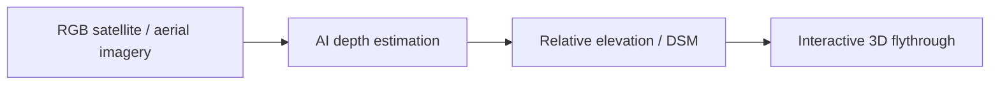
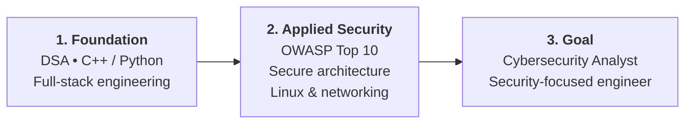

<div align="center">


<a href="https://github.com/omjoshi-2307">
  
</a>

<br/>

<a href="https://om-joshi-portfolio.vercel.app"></a>
<a href="https://www.linkedin.com/in/0m-joshi2307"></a>
<a href="https://github.com/omjoshi-2307"></a>
<a href="https://x.com/omjoshi_2307"></a>
<a href="mailto:omjoshi2307@gmail.com"></a>

</div>

```bash
$ whoami
om-joshi [B.E. Information Technology @ NMIET Pune (SPPU '29) | CGPA: 8.2]

$ role
Student → Builder → Learner → Problem Solver

$ trajectory
Software Engineering Foundations → Application Security → Cybersecurity Analyst

$ mindset
"Learn → Build → Improve → Repeat"
```

---

## 👨‍💻 About Me

I'm a **first-year Information Technology engineering student** at **Nutan Maharashtra Institute of Engineering and Technology (NMIET), Pune**, affiliated with *Savitribai Phule Pune University*. I learn best by turning ideas into working software, competing in hackathons, and tackling real engineering problems.

My journey started with full-stack development and embedded hardware, and I'm now steering that foundation toward **cybersecurity, secure software engineering, and systems**.

- 🎓 **Academics:** B.E. in Information Technology (2025–2029) • CGPA **8.2**
- 📍 **Location:** Pune, Maharashtra, India
- 💡 **Philosophy:** Strong software engineering fundamentals are the bedrock of effective cybersecurity.
- 🎯 **Career direction:** Cybersecurity Analyst / security-focused engineer

---

## ⚡ Current Focus

<table>
  <tr>
    <td width="50%" valign="top">
      <h3>⚡ Building</h3>
      <ul>
        <li><b>SureD 2.0:</b> expanding collaborative rental-deposit escrow to multi-tenant roommate splits and joint agreements.</li>
        <li><b>DepthWizard:</b> leading team <i>SochX Horizon</i> on ISRO's SIH 2026 disaster-management 3D terrain visualization prototype.</li>
      </ul>
    </td>
    <td width="50%" valign="top">
      <h3>🛡️ Learning</h3>
      <ul>
        <li><b>CS fundamentals:</b> Data Structures &amp; Algorithms in C++ and Python.</li>
        <li><b>Security essentials:</b> OWASP web vulnerabilities, secure coding, Linux security.</li>
        <li><b>Systems:</b> networking protocols, REST APIs, defensive security workflows.</li>
      </ul>
    </td>
  </tr>
  <tr>
    <td width="50%" valign="top">
      <h3>🧠 Exploring</h3>
      <ul>
        <li><b>Computer vision &amp; AI:</b> monocular depth estimation and elevation reconstruction from remote-sensing imagery.</li>
        <li><b>Cloud &amp; infrastructure:</b> cloud basics, deployment pipelines, modern web environments.</li>
      </ul>
    </td>
    <td width="50%" valign="top">
      <h3>🌐 Engaging</h3>
      <ul>
        <li><b>Hackathons:</b> rapid prototyping under time pressure with cross-functional teams.</li>
        <li><b>Open source:</b> reading repositories, learning developer workflows, writing clean code.</li>
      </ul>
    </td>
  </tr>
</table>

---

## 🛠️ Tech Stack

<div align="center">

**Languages**<br/>


**Frontend & Backend**<br/>


**Systems, Security & Tools**<br/>


**Hardware & Exploration**<br/>


</div>

<details>
<summary><b>🔍 Detailed breakdown by category</b></summary>

<br/>

| Domain | Technologies | Context |
| :--- | :--- | :--- |
| **Languages** | C, C++, Python, JavaScript (ES6+), TypeScript | DSA, scripting, full-stack logic |
| **Web** | React, Tailwind CSS, Vite, HTML5, CSS3 | Responsive frontends, component architecture |
| **Backend & Storage** | Node.js, Express.js, MongoDB, REST APIs | Endpoints, CRUD workflows, schema design |
| **Security & Systems** | Linux, WSL, Kali Linux *(exploring)*, Git, GitHub, Postman | Security fundamentals, terminal workflows, API testing |
| **AI & Computer Vision** | Python, OpenCV, monocular depth estimation | Feasibility prototypes, terrain mapping, 3D visualization |
| **Embedded & Robotics** | Arduino, C/C++, ultrasonic/IR sensors, ESP32 *(exposure)* | Sensor reading, obstacle detection |
| **Blockchain** *(exploring)* | Stellar, Soroban, Rust | Team exposure through SureD |

</details>

---

## 🚀 Featured Projects

### 1. SureD — Blockchain Rental Escrow Platform
`FEATURED` `FULL-STACK` `TEAM PROJECT`

SureD tackles tenant–landlord trust issues by bringing transparent escrow to rental security deposits. Funds are locked under verifiable conditions, which prevents unilateral withholding and creates clear release and refund paths.

- **Core flow:** Tenant deposits funds → smart escrow lock → landlord verification → settlement.
- **SureD 2.0 (in progress):** moving from single leases to multi-tenant co-living, with split deposits, per-person contribution tracking, and shared verification.
- **Collaboration:** built with *Khushal Choudhary*, who led the Soroban smart contracts. I worked on the application, frontend, state management, and full-stack integration.
- **Stack:** `React` `TypeScript` `Tailwind CSS` `Node.js` `Express` `MongoDB` `Stellar` `Soroban` `Rust`
- **Links:** [GitHub Repository](https://github.com/Khushal-93/SureD) • [Live Application](https://sure-d.vercel.app/)

### 2. DepthWizard — Single-View Height Estimation & 3D Flythrough
`HACKATHON PROTOTYPE` `SIH 2026` `ISRO PS26175`

Selected through the college internal hackathon to lead team **SochX Horizon** at Smart India Hackathon 2026, under ISRO / Department of Space's disaster-management problem statement (*PS26175*).



- **Objective:** explore how relative height maps and digital surface models (DSM) can be generated from single optical remote-sensing images to support rapid disaster reconnaissance.
- **My role:** Team Leader, coordinating pipeline exploration, data preparation, prototyping, and feasibility validation.
- **Stack:** `Python` `Computer Vision` `Monocular Depth Estimation` `Geospatial Imagery` `3D Visualization`
- **Status:** active prototype.

### 3. WALL-E — Autonomous Obstacle-Avoiding Robot
`ROBOTICS` `EMBEDDED SYSTEMS`

An autonomous robot vehicle built to get hands-on with real-time sensor feedback, microcontrollers, and obstacle-avoidance logic.

- **How it works:** ultrasonic distance readings feed a control loop that decides how the robot steers around obstacles.
- **Focus:** hardware–software interplay, motor drivers, sensor calibration, embedded C/C++.
- **Stack:** `C/C++` `Arduino` `Ultrasonic Sensors` `Motor Drivers`

### 4. Jal-Sanchaee-Navachar — Water Conservation Portal
`HACKATHON PROTOTYPE` `FRONTEND`

A hackathon project that spreads water-conservation awareness through an interactive portal.

- **How it works:** visual calculators and simple guidance on rainwater harvesting and household water savings.
- **Focus:** fast prototype delivery, clean responsive UI, collaborative hackathon workflow.
- **Stack:** `HTML5` `CSS3` `JavaScript`

---

## 🏆 Hackathons & Achievements

| Milestone | Details |
| :--- | :--- |
| 🥇 **1st Rank — Code Monopoly** | Won 1st place alongside teammate Khushal in algorithmic problem-solving and rapid implementation. |
| 🚀 **Team Leader — SIH 2026** | Won the college internal hackathon to represent **NMIET** at **Smart India Hackathon 2026** as leader of *SochX Horizon* (ISRO PS26175, *DepthWizard*). |
| ☁️ **Google Cloud Study Jams 2025** | Completed hands-on learning tracks covering compute, cloud storage, identity management, and GCP fundamentals. |
| ⚡ **Collegiate Hackathons** | Took part in **Synapse Hackathon**, **Techathon 3.0**, and **Searchathon**. |

---

## 🗺️ Technical Roadmap



- **Step 1 — Strong software foundation (now):** clean code, data structures and algorithms, OS principles, and full-stack applications.
- **Step 2 — Security specialization (near to mid term):** vulnerability detection, defensive coding, network analysis, and Linux server hardening.
- **Step 3 — Professional destination (long term):** work as a Cybersecurity Analyst or security-focused engineer who can analyze systems and reduce risk from architecture to deployment.

---

## 📊 GitHub Stats

<div align="center">
  <a href="https://github.com/omjoshi-2307">
    
  </a>
  <a href="https://github.com/omjoshi-2307">
    
  </a>
</div>

---

## 🤝 Connect & Collaborate

I'd love to connect with student developers, open-source contributors, security learners, and mentors, whether it's about application security, hackathons, or building practical software.

<div align="center">

| Channel | Link |
| :--- | :--- |
| 🌐 Portfolio | [om-joshi-portfolio.vercel.app](https://om-joshi-portfolio.vercel.app) |
| 💼 LinkedIn | [linkedin.com/in/0m-joshi2307](https://www.linkedin.com/in/0m-joshi2307) |
| 💻 GitHub | [github.com/omjoshi-2307](https://github.com/omjoshi-2307) |
| 🐦 X (Twitter) | [x.com/omjoshi_2307](https://x.com/omjoshi_2307) |
| 📬 Email | [omjoshi2307@gmail.com](mailto:omjoshi2307@gmail.com) |

<br/>


<sub><b>Om Joshi</b> • B.E. Information Technology • Pune, India</sub><br/>
<sub><i>Learn • Build • Improve • Repeat</i></sub>

</div>
