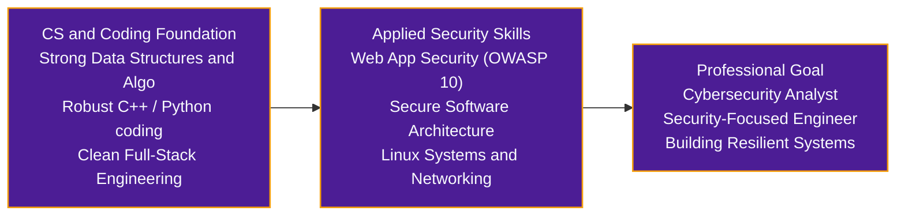

<div align="center">


<a href="https://github.com/omjoshi-2307">
  
</a>

<p>
  <a href="https://om-joshi-portfolio.vercel.app"></a>
  <a href="https://www.linkedin.com/in/0m-joshi2307"></a>
  <a href="https://github.com/omjoshi-2307"></a>
  <a href="https://x.com/omjoshi_2307"></a>
  <a href="mailto:omjoshi2307@gmail.com"></a>
</p>

</div>

```bash
$ whoami
om-joshi [B.E. Information Technology @ NMIET Pune (SPPU '29) | CGPA: 8.2]

$ role
Student → Builder → Learner → Problem Solver

$ trajectory
Software Engineering Foundations → Application Security → Cybersecurity Analyst

$ mindset
"Learn → Build → Improve → Repeat"
```


## ◆ About Me

I am a **1st-Year Information Technology engineering student** at **Nutan Maharashtra Institute of Engineering and Technology (NMIET), Pune** (*Savitribai Phule Pune University*), driven by curiosity, code, and continuous learning.

Rather than building purely for demonstration, I learn best by turning ideas into functional software, competing in hackathons, and tackling tangible engineering problems. My technical journey began with full-stack development and embedded hardware, and I am steadily channeling that engineering foundation toward **Cybersecurity, Secure Software Engineering, and Systems**.

| | |
| :--- | :--- |
| 🎓 **Academics** | B.E. in Information Technology (2025–2029) • Current CGPA: **8.2** |
| 📍 **Location** | Pune, Maharashtra, India |
| 💡 **Philosophy** | Strong software engineering fundamentals are the bedrock of effective cybersecurity. |
| 🎯 **Career Direction** | Aiming toward a career as a **Cybersecurity Analyst** and Security-Focused Engineer. |


## ◆ Current Focus

> [!TIP]
> **⚡ Building** — turning problem statements into workable prototypes
> - **SureD 2.0:** Expanding collaborative rental deposit escrow to multi-tenant roommate splits and joint agreements.
> - **DepthWizard:** Leading team *SochX Horizon* on ISRO's SIH 2026 disaster-management 3D terrain visualization prototype.

> [!NOTE]
> **🛡️ Learning** — strengthening core fundamentals and security principles
> - **CS Fundamentals:** Data Structures & Algorithms in C++ and Python.
> - **Security Essentials:** Web application vulnerabilities (OWASP), secure coding, and Linux system security.
> - **Systems:** Networking protocols, RESTful APIs, and defensive security workflows.

> [!IMPORTANT]
> **🧠 Exploring** — investigating intersecting domains
> - **Computer Vision & AI:** Monocular depth estimation and elevation reconstruction from remote-sensing imagery.
> - **Cloud & Infrastructure:** Cloud computing basics, deployment pipelines, and modern web environments.

> [!WARNING]
> **🌐 Engaging** — active participation in community and teams
> - **Hackathons:** Rapid prototyping under time constraints with cross-functional teams.
> - **Open Source:** Exploring repositories, understanding developer workflows, and writing clean, maintainable code.


## ◆ Tech Stack

| Domain | Technologies & Frameworks | Context / Familiarity |
| :--- | :--- | :--- |
| **Programming Languages** |      | Core problem solving, DSA, scripts, and full-stack logic |
| **Web Development** |      | Modern responsive web frontends and clean component architecture |
| **Backend & Storage** |     | Server-side endpoints, CRUD workflows, and database schema design |
| **Security & Systems** |   -557C94?style=flat-square&logo=kalilinux&logoColor=white)     | Security fundamentals, terminal workflows, version control, API testing |
| **AI & Computer Vision** |    | Feasibility prototypes, terrain mapping, and 3D visualization |
| **Embedded & Robotics** |    -E7352C?style=flat-square&logo=espressif&logoColor=white) | Hardware/software integration, sensor reading, obstacle detection |
| **Blockchain (Exploration)** |    | Team project exposure through *SureD* (collaborative architecture) |


## ◆ Featured Projects

<table>
  <tr>
    <td colspan="2" valign="top">
      <h3>01 · SureD — Blockchain Rental Escrow Platform</h3>
      <sub><code>FEATURED PROJECT</code> <code>FULL-STACK</code> <code>TEAM COLLABORATION</code></sub>
      <p>SureD addresses tenant-landlord trust friction by bringing transparent escrow workflows to rental security deposits. Funds are locked securely under verifiable conditions, removing unilateral deposit withholding and creating transparent release/refund pathways.</p>
      <ul>
        <li><b>Core Flow:</b> Tenant Funds Deposit → Smart Escrow Lock → Landlord Verification → Automated/Confirmed Settlement.</li>
        <li><b>SureD 2.0 (In Progress):</b> Transitioning from single tenant-landlord leases to multi-tenant co-living arrangements, enabling split deposits, individual contribution tracking, and shared verification.</li>
        <li><b>Collaboration &amp; Contribution:</b> Developed collaboratively in a team with <i>Khushal Choudhary</i>. While Khushal led the Soroban smart contract development, I contributed to the application development, frontend interfaces, state management, and full-stack integration.</li>
        <li><b>Tech Stack:</b> <code>React</code> <code>TypeScript</code> <code>Tailwind CSS</code> <code>Node.js</code> <code>Express</code> <code>MongoDB</code> <code>Stellar</code> <code>Soroban</code> <code>Rust</code></li>
      </ul>
      <a href="https://github.com/Khushal-93/SureD"></a>
      <a href="https://sure-d.vercel.app/"></a>
    </td>
  </tr>
  <tr>
    <td colspan="2" valign="top">
      <h3>02 · DepthWizard — Single-View Height Estimation &amp; 3D Flythrough</h3>
      <sub><code>HACKATHON PROTOTYPE</code> <code>SMART INDIA HACKATHON 2026</code> <code>ISRO PS26175</code></sub>
      <p>Selected through the college internal hackathon to lead team <b>SochX Horizon</b> for Smart India Hackathon 2026 under ISRO / Department of Space's disaster management problem statement (<i>PS26175</i>).</p>
      <p><b>RGB Satellite / Aerial Imagery</b> → <b>AI Depth Estimation</b> → <b>Relative Elevation / DSM</b> → <b>Interactive 3D Flythrough</b></p>
      <ul>
        <li><b>Objective:</b> Explore the feasibility of synthesizing relative height representations and digital surface models (DSM) from monocular optical remote-sensing images to assist in rapid disaster reconnaissance.</li>
        <li><b>My Role:</b> <b>Team Leader</b> — coordinating pipeline exploration, data preparation, prototype development, and technical feasibility validation.</li>
        <li><b>Tech Stack:</b> <code>Python</code> <code>Computer Vision</code> <code>Monocular Depth Estimation</code> <code>Geospatial Imagery</code> <code>3D Visualization</code></li>
        <li><b>Status:</b> Active prototype and hackathon project.</li>
      </ul>
    </td>
  </tr>
  <tr>
    <td width="50%" valign="top">
      <h3>03 · WALL-E</h3>
      <b>Autonomous Obstacle-Avoiding Robot</b><br/>
      <sub><code>ROBOTICS</code> <code>EMBEDDED SYSTEMS</code> <code>HARDWARE/SOFTWARE INTEGRATION</code></sub>
      <p>An autonomous robotic vehicle built to experiment hands-on with real-time sensor feedback, microcontrollers, and obstacle-avoidance logic.</p>
      <ul>
        <li><b>Functionality:</b> Employs ultrasonic distance telemetry to detect spatial boundaries and obstacles, feeding input into an autonomous control loop that dynamically computes navigation vectors.</li>
        <li><b>Focus:</b> Practical hands-on understanding of hardware-software interplay, motor drivers, sensor calibration, and embedded C/C++ control systems.</li>
        <li><b>Tech Stack:</b> <code>C/C++</code> <code>Arduino</code> <code>Ultrasonic Sensors</code> <code>Motor Drivers</code> <code>Embedded Systems</code></li>
      </ul>
    </td>
    <td width="50%" valign="top">
      <h3>04 · Jal-Sanchaee-Navachar</h3>
      <b>Water Conservation Portal</b><br/>
      <sub><code>HACKATHON PROTOTYPE</code> <code>FRONTEND</code> <code>ENVIRONMENTAL INITIATIVE</code></sub>
      <p>A rapid hackathon project designed to spread water conservation awareness through an intuitive, interactive digital portal.</p>
      <ul>
        <li><b>Functionality:</b> Provided visual calculators and accessible guidance on rainwater harvesting and household water savings.</li>
        <li><b>Focus:</b> Rapid prototype delivery, clean responsive UI design, and collaborative hackathon workflow.</li>
        <li><b>Tech Stack:</b> <code>HTML5</code> <code>CSS3</code> <code>JavaScript</code> <code>Responsive UI</code></li>
      </ul>
    </td>
  </tr>
</table>


## ◆ Hackathons & Achievements

| Milestone | Context & Description |
| :--- | :--- |
| 🥇 **1st Rank — Code Monopoly** | Secured **1st place** in *Code Monopoly*, competing alongside teammate Khushal in algorithmic problem-solving and rapid implementation. |
| 🚀 **Team Leader — SIH 2026** | Won the college internal hackathon to represent **NMIET** at **Smart India Hackathon 2026** as Team Leader for *SochX Horizon* (ISRO PS26175 — *DepthWizard*). |
| ☁️ **Google Cloud Study Jams 2025** | Completed hands-on cloud learning tracks covering compute infrastructure, cloud storage, identity management, and GCP fundamentals. |
| ⚡ **Collegiate Hackathon Experience** | Active participant in competitive hackathons including **Synapse Hackathon**, **Techathon 3.0**, and **Searchathon**, turning challenges into prototypes. |


## ◆ Technical Roadmap & Career Trajectory



| Step 1 — Now | Step 2 — Near-to-Mid Term | Step 3 — Long-Term |
| :--- | :--- | :--- |
| **Strong Software Foundation (Current):** Writing clean code, mastering data structures and algorithms, understanding operating system principles, and building full-stack applications. | **Security Specialization:** Advancing from basic security awareness to deep application security—learning vulnerability detection, defensive coding standards, network analysis, and Linux server hardening. | **Professional Destination:** Stepping into the industry as a **Cybersecurity Analyst** or security-focused engineer who can analyze systems, mitigate risks, and ensure software reliability from architecture to deployment. |


## ◆ GitHub Activity & Statistics

<div align="center">
  <a href="https://github.com/omjoshi-2307">
    
  </a>
  <a href="https://github.com/omjoshi-2307">
    
  </a>
</div>


## ◆ Connect & Collaborate

I'm always keen to connect with fellow student developers, open-source contributors, cybersecurity learners, and mentors. Whether it's discussing application security, hackathon opportunities, or collaborating on practical software:

| Channel | Link |
| :--- | :--- |
| 🌐 **Personal Portfolio** | [om-joshi-portfolio.vercel.app](https://om-joshi-portfolio.vercel.app) |
| 💼 **LinkedIn** | [linkedin.com/in/0m-joshi2307](https://www.linkedin.com/in/0m-joshi2307) |
| 💻 **GitHub** | [github.com/omjoshi-2307](https://github.com/omjoshi-2307) |
| 🐦 **X (Twitter)** | [x.com/omjoshi_2307](https://x.com/omjoshi_2307) |
| 📬 **Direct Email** | [omjoshi2307@gmail.com](mailto:omjoshi2307@gmail.com) |

<div align="center">


<sub><b>Om Joshi</b> • B.E. Information Technology • Pune, India</sub><br/>
<sub><i>Learn • Build • Secure • Repeat</i></sub>

</div>
