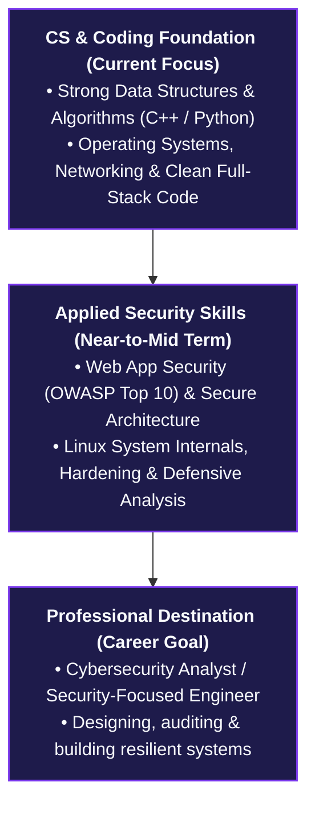

<div align="center">

  <!-- ===================================================== -->
  <!-- HERO BANNER                                           -->
  <!-- ===================================================== -->
  

  <!-- DYNAMIC TYPING TAGLINE -->
  <a href="https://github.com/omjoshi-2307">
    
  </a>

  <!-- STATUS PILL -->
  <p align="center">
    
  </p>

  <!-- QUICK SOCIAL BUTTONS -->
  <p align="center">
    <a href="https://om-joshi-portfolio.vercel.app" target="_blank" rel="noopener noreferrer">
      
    </a>
    &nbsp;
    <a href="https://www.linkedin.com/in/0m-joshi2307" target="_blank" rel="noopener noreferrer">
      
    </a>
    &nbsp;
    <a href="https://github.com/omjoshi-2307" target="_blank" rel="noopener noreferrer">
      
    </a>
    &nbsp;
    <a href="https://x.com/omjoshi_2307" target="_blank" rel="noopener noreferrer">
      
    </a>
    &nbsp;
    <a href="mailto:omjoshi2307@gmail.com">
      
    </a>
  </p>

</div>

<!-- ===================================================== -->
<!-- TERMINAL CONSOLE IDENTITY                             -->
<!-- ===================================================== -->
```bash
┌──(omjoshi㉿terminal)-[~]
└─$ whoami
om-joshi [B.E. Information Technology @ NMIET Pune (SPPU '29) | CGPA: 8.2]

┌──(omjoshi㉿terminal)-[~]
└─$ cat profile.json
{
  "role":        "Student → Builder → Learner → Problem Solver",
  "trajectory":  "Software Engineering Foundations → Application Security → Cybersecurity Analyst",
  "core_creed":  "Learn → Build → Improve → Repeat"
}
```

---

## 👨‍💻 01 // About Me

I am a **1st-Year Information Technology engineering student** at **Nutan Maharashtra Institute of Engineering and Technology (NMIET), Pune** (*Savitribai Phule Pune University*), driven by curiosity, code, and continuous learning.

Rather than building purely for demonstration, I learn best by turning ideas into functional software, competing in hackathons, and tackling tangible engineering problems. My technical journey began with full-stack development and embedded hardware, and I am steadily channeling that engineering foundation toward **Cybersecurity, Secure Software Engineering, and Systems**.

| Profile Attribute | Details & Overview |
| :--- | :--- |
| 🎓 **Academics** | B.E. in Information Technology (2025–2029) • Current CGPA: **8.2** |
| 📍 **Location** | Pune, Maharashtra, India |
| 💡 **Engineering Philosophy** | Strong software engineering fundamentals are the bedrock of effective cybersecurity. |
| 🎯 **Career Direction** | Aiming toward a career as a **Cybersecurity Analyst** and Security-Focused Engineer. |

---

## ⚡ 02 // Current Focus

| ⚡ Active Building | 🛡️ Security & CS Fundamentals |
| :--- | :--- |
| **SureD 2.0 (Escrow Expansion)**<br/>Expanding rental deposit escrow to multi-tenant roommate split contributions and joint release agreements.<br/><br/>**DepthWizard (SIH 2026 / ISRO PS26175)**<br/>Leading team *SochX Horizon* on disaster-management 3D terrain elevation synthesis from monocular remote-sensing imagery. | **Core Computer Science**<br/>Data Structures & Algorithms in C++ and Python; problem solving and complexity optimization.<br/><br/>**Application Security**<br/>Web application vulnerabilities (OWASP Top 10), secure coding principles, and Linux system hardening.<br/><br/>**Systems & Networking**<br/>Network communication protocols, RESTful API design, and defensive security workflows. |

| 🧠 Vision & AI Exploration | 🌐 Community & Collaboration |
| :--- | :--- |
| **Computer Vision & 3D Reconstruction**<br/>Monocular depth estimation and Digital Surface Model (DSM) generation from satellite images.<br/><br/>**Cloud & Infrastructure**<br/>Cloud computing fundamentals, deployment automation, and modern web environments. | **Competitive Hackathons**<br/>Rapid prototyping under constraints with agile, cross-functional engineering teams.<br/><br/>**Open Source Exploration**<br/>Navigating real-world repositories, understanding developer workflows, and writing maintainable code. |

---

## 🛠️ 03 // Tech Stack

| Technical Domain | Technologies & Frameworks | Practical Application & Familiarity |
| :--- | :--- | :--- |
| **Languages** |      | Core problem solving, DSA, automation scripts, and full-stack logic |
| **Frontend Web** |      | Responsive web frontends, modern component state, and UI styling |
| **Backend & Storage** |     | Server-side endpoints, CRUD workflows, and database schema modeling |
| **Security & Systems** |        | Security fundamentals, terminal workflows, version control, API testing |
| **AI & Computer Vision** |    | Feasibility prototypes, terrain elevation mapping, and 3D visualization |
| **Robotics & Hardware** |     | Hardware/software integration, telemetry capture, autonomous navigation |
| **Blockchain (Exploration)** |    | Team project exposure through *SureD* (collaborative architecture) |

---

## 🚀 04 // Featured Projects

### 01 · SureD — Blockchain Rental Security Deposit Escrow
`FEATURED PROJECT` • `FULL-STACK WEB` • `TEAM COLLABORATION`

> **Transparent rental security deposit management powered by verifiable escrow logic to eliminate deposit withholding disputes.**

```
[ Tenant Deposit ] ──► [ Smart Escrow Lock ] ──► [ Dual Landlord-Tenant Verification ] ──► [ Transparent Settlement ]
```

* **The Problem & Solution:** Addresses tenant-landlord trust friction by bringing transparent escrow workflows to rental security deposits. Funds are locked securely under verifiable conditions, eliminating unilateral deposit withholding and establishing unambiguous refund pathways.
* **SureD 2.0 (In Progress):** Transitioning from one-to-one leases to multi-tenant co-living arrangements—enabling individual roommate contribution tracking, split deposits, and multi-party confirmation.
* **Team Context & Contribution:** Developed collaboratively with *Khushal Choudhary*. While Khushal led the Soroban smart contract engineering, I contributed to application development, frontend interfaces, state management, and full-stack integration.
* **Tech Stack:** `React` `TypeScript` `Tailwind CSS` `Node.js` `Express` `MongoDB` `Stellar` `Soroban` `Rust`
* **Links:** &nbsp;[**GitHub Repository**](https://github.com/Khushal-93/SureD) &nbsp;|&nbsp; [**Live Application**](https://sure-d.vercel.app/)

<br/>

### 02 · DepthWizard — Single-View Height Estimation & 3D Flythrough
`HACKATHON PROTOTYPE` • `SMART INDIA HACKATHON 2026` • `ISRO PS26175`

> **Synthesizing relative height representations and 3D elevation flythroughs from single-view optical remote-sensing imagery.**

```
[ RGB Satellite Imagery ] ──► [ AI Depth Estimation ] ──► [ Elevation Map / DSM ] ──► [ Interactive 3D Flythrough ]
```

* **Objective:** Selected through the college internal hackathon to lead team **SochX Horizon** for Smart India Hackathon 2026 under ISRO / Department of Space's disaster management problem statement (*PS26175*). Demonstrating the feasibility of rapidly estimating digital surface models (DSM) from monocular optical satellite images for rapid disaster assessment.
* **My Role:** **Team Leader** — coordinating pipeline exploration, data preparation, prototype development, and technical feasibility validation.
* **Tech Stack:** `Python` `Computer Vision` `Monocular Depth Estimation` `Geospatial Imagery` `3D Visualization`
* **Status:** Active prototype and hackathon project.

<br/>

### 03 · WALL-E — Autonomous Obstacle-Avoiding Robot
`ROBOTICS` • `EMBEDDED SYSTEMS` • `AUTONOMOUS CONTROL`

> **An autonomous robotic vehicle combining real-time ultrasonic sensor feedback with dynamic navigation control logic.**

* **Functionality:** Employs ultrasonic distance telemetry to detect spatial boundaries and obstacles, feeding input into an autonomous control loop that dynamically computes navigation vectors.
* **Focus:** Hands-on understanding of hardware-software interplay, motor drivers, sensor calibration, and embedded C/C++ control systems.
* **Tech Stack:** `C/C++` `Arduino` `Ultrasonic Sensors` `Motor Drivers` `Embedded Systems`

<br/>

### 04 · Jal-Sanchaee-Navachar — Water Conservation Portal
`HACKATHON PROTOTYPE` • `FRONTEND` • `ENVIRONMENTAL INITIATIVE`

> **An interactive digital portal promoting water conservation awareness and rainwater harvesting calculations.**

* **Functionality:** Provided visual calculators and accessible guidance on rainwater harvesting and household water savings.
* **Focus:** Rapid prototype delivery, clean responsive UI design, and collaborative hackathon workflow.
* **Tech Stack:** `HTML5` `CSS3` `JavaScript` `Responsive UI`

---

## 🏆 05 // Hackathons & Achievements

| Milestone | Event / Organization | Context & Description |
| :---: | :--- | :--- |
| 🥇 | **1st Rank — Code Monopoly** | Secured **1st place** in *Code Monopoly*, competing alongside teammate Khushal in algorithmic problem-solving and rapid implementation. |
| 🚀 | **Team Leader — SIH 2026** | Won the college internal hackathon to represent **NMIET** at **Smart India Hackathon 2026** as Team Leader for *SochX Horizon* (ISRO PS26175 — *DepthWizard*). |
| ☁️ | **Google Cloud Study Jams 2025** | Completed hands-on cloud learning tracks covering compute infrastructure, cloud storage, identity management, and GCP fundamentals. |
| ⚡ | **Collegiate Hackathon Circuit** | Active participant in competitive hackathons including **Synapse Hackathon**, **Techathon 3.0**, and **Searchathon**, turning challenges into prototypes. |

---

## 🗺️ 06 // Technical Roadmap & Career Trajectory



| Step 1 — Current Focus | Step 2 — Specialization | Step 3 — Career Goal |
| :--- | :--- | :--- |
| **Strong Software Foundation:** Writing clean code, mastering data structures and algorithms, understanding operating system principles, and building full-stack applications. | **Security Specialization:** Advancing from basic security awareness to deep application security—learning vulnerability detection, defensive coding standards, network analysis, and Linux server hardening. | **Professional Destination:** Stepping into the industry as a **Cybersecurity Analyst** or security-focused engineer who can analyze systems, mitigate risks, and ensure software reliability from architecture to deployment. |

---

## 📊 07 // GitHub Activity & Statistics

<p align="center">
  <a href="https://github.com/omjoshi-2307">
    
  </a>
  &nbsp;
  <a href="https://github.com/omjoshi-2307">
    
  </a>
</p>

---

## 🤝 08 // Connect & Collaborate

I am always keen to connect with fellow student developers, open-source contributors, cybersecurity learners, and mentors. Whether it's discussing application security, hackathon opportunities, or collaborating on practical software:

| Platform | Handle / Address | Direct Action |
| :--- | :--- | :--- |
| 🌐 **Portfolio** | `om-joshi-portfolio.vercel.app` | [**Visit Website**](https://om-joshi-portfolio.vercel.app) |
| 💼 **LinkedIn** | `in/0m-joshi2307` | [**Connect on LinkedIn**](https://www.linkedin.com/in/0m-joshi2307) |
| 💻 **GitHub** | `omjoshi-2307` | [**Follow on GitHub**](https://github.com/omjoshi-2307) |
| 🐦 **X (Twitter)** | `@omjoshi_2307` | [**Follow on X**](https://x.com/omjoshi_2307) |
| 📬 **Email** | `omjoshi2307@gmail.com` | [**Send Email**](mailto:omjoshi2307@gmail.com) |

<br/>

<div align="center">

  

  <sub><b>Om Joshi</b> • B.E. Information Technology • Pune, India</sub><br/>
  <sub><i>Learn • Build • Secure • Repeat</i></sub>

</div>
